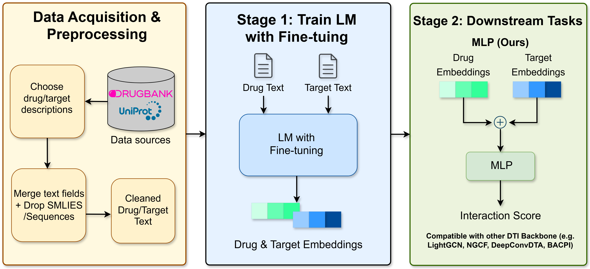

# DrugLM: A Text-Driven Language Model Framework for Enhancing Drug-Target Interaction

DrugLM is a unified framework that integrates Large Language Model (LLM)-derived embeddings into Drug-Target Interaction (DTI) prediction architectures. Our approach leverages rich textual descriptions of drugs and targets to generate semantic embeddings using multiple pre-trained language models.

This repository provides the complete implementation for generating language model embeddings and running downstream DTI prediction tasks. The codebase is organized into two main components: upstream embedding generation using three language models (BGE, E5, GTE) in both pretrained and fine-tuned configurations, and downstream DTI prediction using various neural network architectures.



## Installation

### 1. Clone the Repository

```bash
git clone https://github.com/ShPhoebus/DrugLM.git
cd DrugLM
```

### 2. Install Dependencies

```bash
pip install -r requirements.txt
```

### 3. Download Data and Pre-trained Embeddings

Before running any experiments, you need to download the required datasets, it also includes the trained LM embeddings (in the 'LM_finetun' folder), which can be directly used for training downstream tasks:

```bash
python download_data_embeddings.py
```


## Available Models

- **BGE**: BAAI/bge-large-en-v1.5
- **E5**: intfloat/e5-large-v2  
- **GTE**: Alibaba-NLP/gte-large-en-v1.5

## Usage

### Run Pretrained Models

```bash
# Run BGE pretrained model
python run_lm_model.py bge

# Run E5 pretrained model
python run_lm_model.py e5

# Run GTE pretrained model
python run_lm_model.py gte
```

### Run Fine-tuned Models

```bash
# Run BGE fine-tuned model
python run_lm_model.py bge --finetune

# Run E5 fine-tuned model
python run_lm_model.py e5 --finetune

# Run GTE fine-tuned model
python run_lm_model.py gte --finetune
```

### Run Downstream Tasks

```bash
# MLP-based DTI prediction
python run_downstream_task.py mlp --embedding-file bge_NonFT.pt --dim 1024

# GNN-based DTI prediction with LightGCN
python run_downstream_task.py gnn --embedding-file bge_NonFT.pt --dim 1024 --gnn-model lightgcn --epochs 1000

# GNN-based DTI prediction with NGCF
python run_downstream_task.py gnn --embedding-file bge_NonFT.pt --dim 1024 --gnn-model ngcf --epochs 1000

# DeepConvDTI-based DTI prediction
python run_downstream_task.py deepconv --embedding-file bge_NonFT.pt --dim 1024 --epochs 30

# GraphDTA-based DTI prediction
python run_downstream_task.py graphdta --embedding-file bge_NonFT.pt --dim 1024 --epochs 100
```
