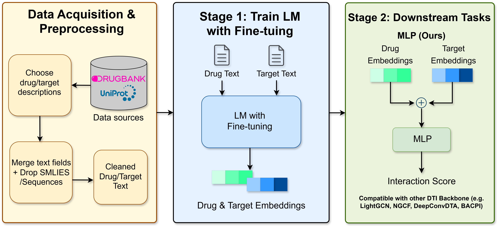

# DrugLM: A Unified Framework to Enhance Drug-Target Interaction Predictions by Incorporating Textual Embeddings via Language Models

DrugLM is a unified framework that integrates embeddings from large language models (LLMs) into drug-target interaction (DTI) prediction models. We systematically evaluate multiple LLMs on benchmark DTI datasets and demonstrate strong performance, even without fine-tuning.

For more details, please refer to our preprint:
**Paper**: bioRxiv, https://doi.org/10.1101/2025.07.09.657250

This repository provides the implementation for generating language model embeddings and running downstream DTI prediction tasks. The codebase is organized into two main components: upstream embedding generation using three language models (BGE, E5, GTE) in both pretrained and fine-tuned configurations, and downstream DTI predictions across five architectures (MLP-DTI, DeepConv-DTI, GraphDTA, LightGCN, NGCF, and BACPI).



---

## Installation

### 1. Clone the Repository

```bash
git clone https://github.com/ShPhoebus/DrugLM.git
cd DrugLM
```

### 2. Install Dependencies

```bash
pip install -r requirements.txt
```

### 3. Download Embeddings

Before running any experiments, download the required datasets and pre-computed LM embeddings (saved to `LM_finetune/`):

```bash
python download_data_embeddings.py
```

---

## Available Language Models

| Model | HuggingFace ID |
|-------|---------------|
| **BGE** | `BAAI/bge-large-en-v1.5` |
| **E5** | `intfloat/e5-large-v2` |
| **GTE** | `Alibaba-NLP/gte-large-en-v1.5` |

---

## Usage

### Generate LM Embeddings

```bash
# Pretrained
python run_lm_model.py bge
python run_lm_model.py e5
python run_lm_model.py gte

# Fine-tuned
python run_lm_model.py bge --finetune
python run_lm_model.py e5 --finetune
python run_lm_model.py gte --finetune
```

### Run Downstream DTI Tasks

```bash
# MLP-based DTI
python run_downstream_task.py mlp --embedding-file LM_finetune/e5_FT_embedding.pt --dim 1024

# DeepConvDTI-based DTI
python run_downstream_task.py deepconv --embedding-file LM_finetune/e5_FT_embedding.pt --dim 1024 --epochs 30

# GraphDTA-based DTI
python run_downstream_task.py graphdta --embedding-file LM_finetune/e5_FT_embedding.pt --dim 1024 --epochs 100

# GNN-based DTI (LightGCN)
python run_downstream_task.py gnn --embedding-file LM_finetune/e5_FT_embedding.pt --dim 1024 --gnn-model lightgcn --epochs 1000

# GNN-based DTI (NGCF)
python run_downstream_task.py gnn --embedding-file LM_finetune/e5_FT_embedding.pt --dim 1024 --gnn-model ngcf --epochs 1000

# BACPI (standalone)
cd BACPI/code && python main.py
```

---

## Citation

If you find this work useful, please cite our paper:

```bibtex
@article{DrugLM2025,
  title={DrugLM: A Unified Framework to Enhance Drug-Target Interaction Predictions
         by Incorporating Textual Embeddings via Language Models},
  author={...},
  journal={bioRxiv},
  year={2025},
  doi={10.1101/2025.07.09.657250}
}
```

---

## License

This project is licensed under the MIT License.
